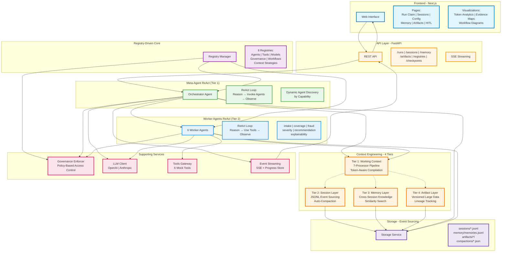

# AgentMesh - High-Level Architecture (Simplified)

This is a simplified, browser-friendly version of the complete technical architecture diagram.

## Overview

AgentMesh implements a **two-tier ReAct architecture** with **registry-driven orchestration** and **4-tier context engineering** for production-scale multi-agent systems.

---

## Simplified Architecture Diagram



---

## Key Architectural Patterns

### 1️⃣ Two-Tier ReAct Architecture

```
┌─────────────────────────────────────┐
│  ORCHESTRATOR (Meta-Agent)          │
│  ┌─────────────────────────────┐    │
│  │ Reason: Which agents needed?│    │
│  │ Action: Invoke agent_fraud  │    │
│  │ Observe: {fraud_score: 85}  │    │
│  └─────────────────────────────┘    │
└──────────────┬──────────────────────┘
               │ invokes
               ▼
┌─────────────────────────────────────┐
│  WORKER AGENT (fraud_agent)         │
│  ┌─────────────────────────────┐    │
│  │ Reason: Need fraud rules    │    │
│  │ Action: Use fraud_rules tool│    │
│  │ Observe: {indicators: [...]}│    │
│  └─────────────────────────────┘    │
└─────────────────────────────────────┘
```

**Why Two Tiers?**
- Orchestrator reasons about *which agents* to use
- Worker agents reason about *which tools* to use
- Clean separation of concerns
- Unlimited scalability (add agents without changing orchestrator)

### 2️⃣ Registry-Driven Architecture

```
┌──────────────────────────────────────────┐
│  Registries (8 JSON files)               │
│  ┌────────────────────────────────────┐  │
│  │ agent_registry.json                │  │
│  │ tool_registry.json                 │  │
│  │ model_profiles.json                │  │
│  │ governance_policies.json           │  │
│  │ workflows/claims_triage.json       │  │
│  │ context_strategies.json            │  │
│  │ context_processor_pipeline.json    │  │
│  │ system_config.json                 │  │
│  └────────────────────────────────────┘  │
└──────────────────┬───────────────────────┘
                   │ loaded at runtime
                   ▼
           ┌───────────────┐
           │ Zero Hardcoded│
           │   Workflows   │
           └───────────────┘
```

**Benefits:**
- ✅ Hot-reload without restart
- ✅ Add agents by editing JSON
- ✅ Change policies without code changes
- ✅ A/B test different LLM models

### 3️⃣ Context Engineering (4 Tiers)

```
Tier 1: WORKING CONTEXT (ephemeral)
├── 7-Processor Pipeline
│   1. ContentSelector    → Filter noise
│   2. CompactionChecker  → Trigger summarization
│   3. MemoryRetriever    → Load cross-session knowledge
│   4. ArtifactResolver   → Resolve large data handles
│   5. Transformer        → Convert to LLM format
│   6. TokenBudgetEnforcer→ Enforce limits
│   7. Injector           → Final formatting
└── Token-aware compilation for each LLM call
    ↓
Tier 2: SESSION LAYER (durable)
├── Complete JSONL event log
├── Auto-compaction when >8K tokens
└── Ground truth for replay
    ↓
Tier 3: MEMORY LAYER (long-term)
├── Cross-session insights
├── Similarity search
└── Reactive + proactive retrieval
    ↓
Tier 4: ARTIFACT LAYER (external)
├── Versioned large data
├── Lightweight handles
└── Lineage tracking
```

**Scalability Features:**
- **Token optimization**: 30% input, 50% outputs, 20% observations
- **Prefix caching**: Stable instructions + variable recent events
- **Compaction**: Auto-summarize when thresholds exceeded
- **Externalization**: Large data stored separately

---

## Critical Data Flows

### Flow 1: Claim Submission → Decision

```
1. User submits claim
   ↓
2. POST /runs → Create session
   ↓
3. Orchestrator ReAct loop starts
   ├── Compile context (Tier 1 pipeline)
   ├── LLM: "Invoke intake_agent, coverage_agent"
   ├── Execute agents in parallel
   │   ├── Each agent runs ReAct loop
   │   ├── Agents use tools (fraud_rules, policy_snapshot, etc.)
   │   └── Return validated outputs
   └── Collect outputs
   ↓
4. Orchestrator continues
   ├── LLM: "Invoke fraud_agent based on coverage_agent output"
   ├── Multi-agent handoff with scoped context
   └── Build evidence map
   ↓
5. Evidence map returned + stored as artifact
   ↓
6. SSE stream completes
   ↓
7. Frontend displays decision + evidence
```

### Flow 2: Real-Time Streaming

```
Backend (Sync)           In-Memory           Frontend (Async)
─────────────            ─────────           ────────────────
OrchestratorRunner
  │
  ├─ Log event ──────→ ProgressStore ←───── SSE poll (100ms)
  ├─ Log event ──────→ ProgressStore ←───── SSE poll
  ├─ Log event ──────→ ProgressStore ←───── SSE poll
  │                         │
  └─ Complete ──────→  Set status      ──→  Close stream
```

### Flow 3: Context Compilation

```
Agent needs context
  ↓
ContextCompiler.compile_for_agent()
  ↓
ContextProcessorPipeline.execute()
  ├─ 1. Filter noise (remove debug logs)
  ├─ 2. Check compaction (if >8K tokens, trigger)
  ├─ 3. Retrieve memories (load relevant insights)
  ├─ 4. Resolve artifacts (expand or keep as handles)
  ├─ 5. Transform (convert to LLM messages)
  ├─ 6. Enforce budget (truncate if needed)
  └─ 7. Inject (final formatting)
  ↓
Token-optimized context ready for LLM
  ↓
Log to context_lineage.jsonl for observability
```

---

## Governance & Security

### Policy-Based Enforcement

| Policy Type | Example | Enforced By |
|-------------|---------|-------------|
| **Agent Access** | Only orchestrator can invoke agents | GovernanceEnforcer |
| **Tool Access** | fraud_agent → only fraud_rules, similarity | GovernanceEnforcer |
| **Iteration Limits** | Max 5 iterations per agent | AgentReActLoopController |
| **LLM Budgets** | Max 30 LLM calls per session | OrchestratorRunner |
| **HITL Roles** | Only fraud_investigator can approve fraud_review | CheckpointManager |
| **Context Limits** | Max 10K tokens per agent | TokenBudgetEnforcer |

### Multi-Agent Handoff Modes

```
FULL MODE (intake_agent → anyone)
├── Pass complete context
└── Safe for normalized data

SCOPED MODE (fraud_agent → recommendation_agent)
├── Only pass: fraud_score, fraud_indicators, confidence
├── Block: raw_data, internal_calculations
└── Optimized for tokens + privacy

MINIMAL MODE (for expensive agents)
├── Only pass: trigger_reason, agent_id
└── Agent requests additional data if needed
```

---

## Technology Stack Summary

**Backend:**
- FastAPI + Pydantic
- OpenAI SDK + Anthropic SDK
- tiktoken for token counting

**Frontend:**
- Next.js 14 (App Router)
- React 18 + TypeScript
- Tailwind CSS + ReactFlow

**Storage:**
- JSONL (event sourcing)
- JSON (registries, artifacts)

**Production Path:**
- PostgreSQL/MongoDB → sessions
- Redis → caching
- S3 → artifacts
- Vector DB → memory embeddings

---

## Key Metrics

| Component | Count | Purpose |
|-----------|-------|---------|
| **Agents** | 6 workers + 1 orchestrator | Specialized capabilities |
| **Tools** | 6 mock tools | Domain operations |
| **Registries** | 8 JSON files | Configuration-driven behavior |
| **Context Processors** | 7 ordered processors | Token optimization |
| **Event Types** | 40+ types | Complete observability |
| **API Endpoints** | 30+ routes | Full CRUD operations |
| **Frontend Pages** | 9 routes | User workflows |
| **Storage Tiers** | 4 tiers | Scalability + optimization |

---

## Design Principles

1. **Stateless Services** - Scale horizontally
2. **Event Sourcing** - Complete audit trail
3. **Policy-Driven** - Governance in config
4. **Dynamic Discovery** - Zero hardcoding
5. **Bounded Execution** - Prevent runaway loops
6. **Graceful Degradation** - Fallback responses
7. **Token Optimization** - 4-tier context architecture
8. **Complete Observability** - Context lineage tracking
9. **Human-Centric** - HITL + explainability
10. **Production-Ready** - Governance + security

---

## Next Steps to Explore

🔍 **View Detailed Diagram:** [ARCHITECTURE_DIAGRAM.md](ARCHITECTURE_DIAGRAM.md) (view in VS Code with Mermaid extension)

📖 **Read Documentation:**
- [CLAUDE.md](CLAUDE.md) - Developer guide
- [DECISIONS.md](DECISIONS.md) - Architectural decisions
- [docs/](docs/) - Context engineering guides

🚀 **Run the System:**
```bash
docker compose up
# Frontend: http://localhost:3016
# API Docs: http://localhost:8016/docs
```

📊 **Key Features to Try:**
- Submit a claim and watch real-time SSE streaming
- View session replay in observability interface
- Explore token analytics and context compilation
- Configure agents/tools via Config page
- Test HITL checkpoints in intervention dashboard

---

This simplified architecture provides the high-level view. For complete component details, see the full [ARCHITECTURE_DIAGRAM.md](ARCHITECTURE_DIAGRAM.md).
