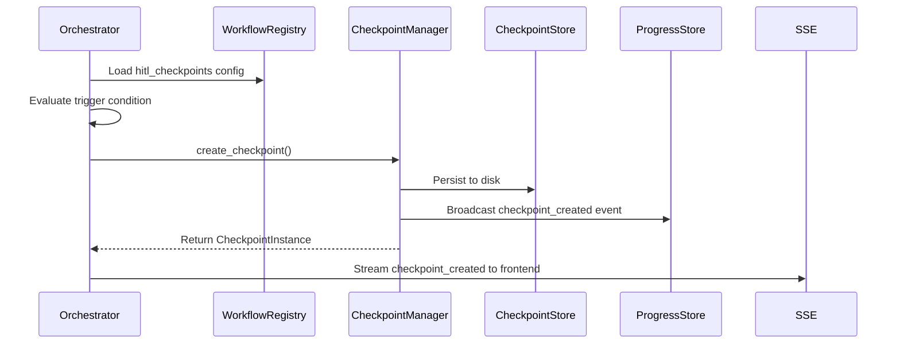
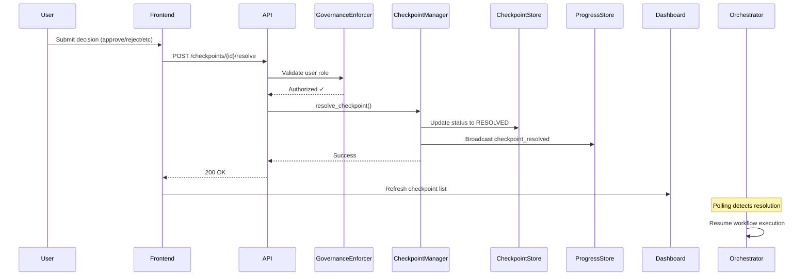

# Human-in-the-Loop (HITL) Design Documentation

## Executive Summary

This document describes the design and architecture for adding Human-in-the-Loop (HITL) capability to AgentMesh, a production-ready multi-agent orchestration platform. The HITL system allows workflows to pause at configurable checkpoints for human intervention, approval, data correction, or decision-making.

**Key Capabilities:**
- ✅ Four intervention types: Approval/Rejection, Data Input/Correction, Decision Selection, Escalation Handling
- ✅ Configurable checkpoints at workflow level (registry-driven)
- ✅ Flexible timeout behaviors (auto-approve, auto-reject, cancel, indefinite wait)
- ✅ Role-based access control (reviewer, approver, admin, fraud_investigator, claims_adjuster)
- ✅ Real-time dashboard with live updates
- ✅ Full event sourcing for audit and replay

---

## Table of Contents

1. [Architecture Overview](#architecture-overview)
2. [Core Components](#core-components)
3. [Checkpoint Lifecycle](#checkpoint-lifecycle)
4. [Configuration System](#configuration-system)
5. [API Reference](#api-reference)
6. [Frontend UI System](#frontend-ui-system)
7. [Security & Permissions](#security--permissions)
8. [Event Sourcing & Observability](#event-sourcing--observability)
9. [Implementation Details](#implementation-details)
10. [Usage Examples](#usage-examples)
11. [Design Decisions](#design-decisions)
12. [Future Enhancements](#future-enhancements)

---

## Architecture Overview

### Design Principles

The HITL implementation adheres to AgentMesh's core architectural principles:

1. **Registry-Driven**: All checkpoint configuration lives in workflow JSON files, not code
2. **Event Sourcing**: Every human decision is logged to JSONL for full auditability
3. **Minimal Invasiveness**: Checkpoint logic injected at strategic points without refactoring core loops
4. **Backward Compatible**: Workflows without checkpoints execute unchanged
5. **Observable**: Real-time streaming of checkpoint events via SSE

### High-Level Flow

```
┌─────────────────────────────────────────────────────────────────┐
│                      Workflow Execution                          │
│  ┌──────────────────────────────────────────────────────────┐   │
│  │  Orchestrator ReAct Loop                                 │   │
│  │  ┌────────────────────────────────────────────────┐      │   │
│  │  │ 1. Pre-Workflow Checkpoint (optional)          │      │   │
│  │  │    ├─ User reviews input data                  │      │   │
│  │  │    └─ Approve/Reject/Modify                    │      │   │
│  │  └────────────────────────────────────────────────┘      │   │
│  │                                                           │   │
│  │  ┌────────────────────────────────────────────────┐      │   │
│  │  │ 2. Agent Execution (multiple iterations)       │      │   │
│  │  │    ├─ Invoke agents                            │      │   │
│  │  │    └─ After-Agent Checkpoint (conditional)     │      │   │
│  │  │        ├─ Review agent output                  │      │   │
│  │  │        └─ Approve/Modify/Escalate              │      │   │
│  │  └────────────────────────────────────────────────┘      │   │
│  │                                                           │   │
│  │  ┌────────────────────────────────────────────────┐      │   │
│  │  │ 3. Before-Completion Checkpoint (optional)     │      │   │
│  │  │    ├─ Review evidence map                      │      │   │
│  │  │    └─ Approve/Reject/Request Revision          │      │   │
│  │  └────────────────────────────────────────────────┘      │   │
│  └──────────────────────────────────────────────────────────┘   │
└─────────────────────────────────────────────────────────────────┘

┌─────────────────────────────────────────────────────────────────┐
│                    Human Interaction Layer                       │
│  ┌────────────────┐    ┌────────────────┐    ┌──────────────┐   │
│  │ HITL Dashboard │───▶│ Checkpoint API │───▶│  Checkpoint  │   │
│  │  (Frontend)    │    │   (FastAPI)    │    │   Manager    │   │
│  └────────────────┘    └────────────────┘    └──────────────┘   │
│         │                      │                      │          │
│         │                      │                      │          │
│         ▼                      ▼                      ▼          │
│   SSE Events            Role Validation       State Storage     │
└─────────────────────────────────────────────────────────────────┘
```

### Checkpoint Trigger Points

The system supports three strategic trigger points in the orchestrator lifecycle:

1. **Pre-Workflow**: Before any agent execution begins
   - Use case: Review and validate input data
   - Example: Claims adjuster reviews claim details before processing

2. **After-Agent**: After specific agent completes execution
   - Use case: Validate agent output, especially on conditional triggers
   - Example: Fraud investigator reviews high fraud scores

3. **Before-Completion**: Before workflow returns final evidence map
   - Use case: Final approval of recommendations
   - Example: Senior approver signs off on claim decision

---

## Core Components

### 1. CheckpointManager (Backend Service)

**Location**: `backend/orchestrator/app/services/checkpoint_manager.py`

**Responsibilities:**
- Create and manage checkpoint instances
- Track checkpoint status (pending/resolved/timeout/cancelled)
- Store human decisions and resolutions
- Handle timeout logic via background thread
- Enforce role-based access control
- Thread-safe concurrent access

**Key Data Structure:**
```python
class CheckpointInstance:
    checkpoint_instance_id: str        # Unique ID (UUID)
    session_id: str                    # Workflow session
    workflow_id: str                   # Workflow type
    checkpoint_id: str                 # Config ID from registry
    checkpoint_type: CheckpointType    # approval/decision/input/escalation
    checkpoint_name: str               # Human-readable name
    status: CheckpointStatus           # pending/resolved/timeout/cancelled
    created_at: str                    # ISO timestamp
    timeout_at: Optional[str]          # When timeout occurs
    resolved_at: Optional[str]         # When resolved
    resolution: Optional[CheckpointResolution]  # Human decision
    context_data: Dict[str, Any]       # Data for UI display
    required_role: str                 # Role needed to resolve
    on_timeout: Optional[str]          # Timeout action
```

**Thread Safety:**
- Uses `threading.Lock` for all state mutations
- Background thread for timeout checking (daemon, polls every 30s)
- Safe for concurrent orchestrator invocations

### 2. CheckpointStore (Persistence Layer)

**Location**: `backend/orchestrator/app/services/checkpoint_store.py`

**Responsibilities:**
- Persist checkpoint instances to disk
- Load checkpoints for recovery
- JSONL format for consistency with session storage
- Support checkpoint history queries

**Storage Pattern:**
```
storage/
├── checkpoints/
│   ├── {checkpoint_instance_id}.json      # Individual checkpoint state
│   └── index/
│       ├── pending.jsonl                   # Fast pending lookup
│       └── by_session_{session_id}.jsonl  # Session checkpoints
```

### 3. Checkpoint API (REST Endpoints)

**Location**: `backend/orchestrator/app/api/checkpoints.py`

**Endpoints:**

| Method | Endpoint | Description |
|--------|----------|-------------|
| GET | `/checkpoints/pending` | List pending checkpoints (filterable by role/workflow) |
| GET | `/checkpoints/{checkpoint_instance_id}` | Get specific checkpoint details |
| POST | `/checkpoints/{checkpoint_instance_id}/resolve` | Resolve checkpoint with human decision |
| POST | `/checkpoints/{checkpoint_instance_id}/cancel` | Cancel checkpoint (admin only) |

**Authentication & Authorization:**
- Role validation via `GovernanceEnforcer.check_hitl_access()`
- Backend enforces permissions (403 on unauthorized)
- Frontend filters checkpoints by user role (UX only)

### 4. Orchestrator Integration

**Location**: `backend/orchestrator/app/services/orchestrator_runner.py`

**Modification Strategy**: Inject checkpoint checks at strategic points without breaking existing flow

**New Dependencies:**
```python
class OrchestratorRunner:
    def __init__(self, ...):
        # ... existing dependencies ...
        self.checkpoint_manager = get_checkpoint_manager()
```

**Injection Points:**

#### Pre-Workflow Checkpoint
```python
def execute(self, original_input: Dict[str, Any]) -> OrchestratorResult:
    self._log_event("orchestrator_started", {...})

    # NEW: Pre-workflow checkpoint
    checkpoint = self._check_pre_workflow_checkpoint(original_input)
    if checkpoint:
        self._log_event("checkpoint_created", {...})
        resolution = self._wait_for_checkpoint_resolution(checkpoint)

        if resolution.action == "reject":
            return OrchestratorResult(status="cancelled",
                                     completion_reason="pre_workflow_rejected")

        # Apply data updates from human
        if resolution.data_updates:
            original_input.update(resolution.data_updates)

    # Continue with existing orchestrator loop...
```

#### After-Agent Checkpoint
```python
# Inside orchestrator loop, after agent invocations
elif reasoning.action.type == OrchestratorActionType.INVOKE_AGENTS:
    success = self._execute_agent_invocations(...)

    # NEW: Check for after-agent checkpoints
    for agent_request in reasoning.action.agent_requests:
        agent_id = agent_request.agent_id
        agent_output = self.prior_outputs.get(agent_id)

        checkpoint = self._check_after_agent_checkpoint(agent_id, agent_output)
        if checkpoint:
            self._log_event("checkpoint_created", {...})
            resolution = self._wait_for_checkpoint_resolution(checkpoint)

            if resolution.action == "cancel_workflow":
                return OrchestratorResult(status="cancelled")

            # Apply human corrections to agent output
            if resolution.data_updates:
                self.prior_outputs[agent_id].update(resolution.data_updates)
```

#### Before-Completion Checkpoint
```python
elif reasoning.action.type == OrchestratorActionType.WORKFLOW_COMPLETE:
    evidence_map = reasoning.action.evidence_map

    # NEW: Before-completion checkpoint
    checkpoint = self._check_before_completion_checkpoint(evidence_map)
    if checkpoint:
        self._log_event("checkpoint_created", {...})
        resolution = self._wait_for_checkpoint_resolution(checkpoint)

        if resolution.action == "reject":
            # Continue loop - don't complete yet
            continue

        if resolution.action == "request_revision":
            # Add human feedback to observations
            self.observations.append({
                "type": "human_feedback",
                "feedback": resolution.comments,
                "requested_changes": resolution.data_updates
            })
            continue

    # Proceed with completion validation...
```

**New Helper Methods:**

```python
def _check_pre_workflow_checkpoint(
    self,
    original_input: Dict[str, Any]
) -> Optional[CheckpointInstance]:
    """Check if pre-workflow checkpoint is configured"""
    for checkpoint_config in self.workflow.get("hitl_checkpoints", []):
        if checkpoint_config["trigger_point"] == "pre_workflow":
            # Evaluate trigger condition (if exists)
            if self._evaluate_checkpoint_condition(checkpoint_config, None, original_input):
                return self.checkpoint_manager.create_checkpoint(
                    session_id=self.session_id,
                    workflow_id=self.workflow_id,
                    checkpoint_config=checkpoint_config,
                    context_data={"original_input": original_input}
                )
    return None

def _wait_for_checkpoint_resolution(
    self,
    checkpoint: CheckpointInstance
) -> CheckpointResolution:
    """
    Wait for checkpoint to be resolved (blocking with polling).

    Polls checkpoint status with exponential backoff.
    Handles timeout logic.
    """
    import time
    poll_interval = 1.0  # Start with 1 second
    max_poll_interval = 10.0

    while True:
        # Check if resolved
        current = self.checkpoint_manager.get_checkpoint(
            checkpoint.checkpoint_instance_id
        )

        if current.status == CheckpointStatus.RESOLVED:
            self._log_event("checkpoint_resolved", {
                "checkpoint_id": checkpoint.checkpoint_id,
                "action": current.resolution.action,
                "user_id": current.resolution.user_id
            })
            return current.resolution

        # Check timeout
        timeout_action = self.checkpoint_manager.check_timeout(
            checkpoint.checkpoint_instance_id
        )
        if timeout_action:
            self._log_event("checkpoint_timeout", {
                "checkpoint_id": checkpoint.checkpoint_id,
                "timeout_action": timeout_action
            })
            return self._handle_checkpoint_timeout(checkpoint, timeout_action)

        # Poll with exponential backoff
        time.sleep(poll_interval)
        poll_interval = min(poll_interval * 1.5, max_poll_interval)

def _evaluate_checkpoint_condition(
    self,
    checkpoint_config: Dict,
    agent_output: Optional[Dict],
    original_input: Dict
) -> bool:
    """Evaluate trigger condition for conditional checkpoints"""
    trigger_condition = checkpoint_config.get("trigger_condition")
    if not trigger_condition:
        return True  # No condition = always trigger

    condition_type = trigger_condition.get("type")
    condition_expr = trigger_condition.get("condition")

    if condition_type == "output_based" and agent_output:
        # Simple expression evaluation: "fraud_score > 0.7"
        # Parse and evaluate safely (no eval())
        return self._evaluate_expression(condition_expr, agent_output)

    return True
```

### 5. Frontend HITL Dashboard

**Location**: `frontend/app/hitl/page.tsx`

**Features:**
- Real-time list of pending checkpoints
- Role-based filtering (dropdown)
- Auto-refresh every 10 seconds
- Expandable checkpoint cards
- Inline resolution (approval, decision, input forms)
- Timeout countdown timers
- Navigation to session replay/evidence

**Component Hierarchy:**
```
HITLDashboard (page.tsx)
├── RoleFilter (select dropdown)
├── CheckpointList
│   └── CheckpointCard (for each pending checkpoint)
│       ├── CheckpointHeader (name, timestamp, timeout)
│       ├── CheckpointContext (display relevant data)
│       └── CheckpointResolver (type-specific UI)
│           ├── ApprovalCheckpoint (approve/reject buttons)
│           ├── DecisionCheckpoint (radio options)
│           ├── InputCheckpoint (editable form fields)
│           └── EscalationCheckpoint (escalation UI)
```

---

## Checkpoint Lifecycle

### 1. Creation Phase

**Trigger**: Orchestrator evaluates checkpoint configuration and condition



**Event Logged:**
```json
{
  "event_type": "checkpoint_created",
  "session_id": "sess_abc123",
  "checkpoint_id": "fraud_review",
  "checkpoint_instance_id": "cp_xyz789",
  "checkpoint_name": "Fraud Signal Review",
  "required_role": "fraud_investigator",
  "timeout_at": "2025-12-30T15:30:00Z",
  "context_data": {...}
}
```

### 2. Pending Phase

**State**: Orchestrator blocks in `_wait_for_checkpoint_resolution()` with polling

**Frontend Flow:**
1. SSE event received → UI shows new checkpoint in dashboard
2. User with matching role sees checkpoint card
3. User clicks "View & Resolve"
4. Type-specific resolution UI renders

**Timeout Monitoring:**
- Background thread in CheckpointManager checks every 30 seconds
- If `timeout_at` passed and status still PENDING:
  - Apply `on_timeout` action
  - Create system resolution
  - Update status to TIMEOUT

### 3. Resolution Phase

**Trigger**: User submits decision via frontend



**Event Logged:**
```json
{
  "event_type": "checkpoint_resolved",
  "session_id": "sess_abc123",
  "checkpoint_id": "fraud_review",
  "checkpoint_instance_id": "cp_xyz789",
  "resolution": {
    "action": "confirm_fraud",
    "user_id": "john.doe@example.com",
    "user_role": "fraud_investigator",
    "comments": "High confidence fraud - similar pattern to case #1234",
    "resolved_at": "2025-12-30T14:25:00Z"
  }
}
```

### 4. Resumption Phase

**Trigger**: Orchestrator's polling loop detects resolution

```python
# Orchestrator resumes from _wait_for_checkpoint_resolution()
resolution = self._wait_for_checkpoint_resolution(checkpoint)

# Apply resolution
if resolution.action == "approve":
    # Continue workflow
    pass
elif resolution.action == "reject":
    # Cancel workflow
    return OrchestratorResult(status="cancelled")
elif resolution.action == "confirm_fraud":
    # Update agent output with human decision
    self.prior_outputs["fraud_agent"]["human_confirmed"] = True
    self.prior_outputs["fraud_agent"]["confirmation_reason"] = resolution.comments
```

---

## Configuration System

### Workflow Registry Schema

**Location**: `registries/workflows/{workflow_id}.json`

**New Section**: `hitl_checkpoints` (array)

```json
{
  "workflow_id": "claims_triage",
  "name": "Claims Triage Workflow",
  "mode": "advisory",

  "hitl_checkpoints": [
    {
      "checkpoint_id": "fraud_review",
      "checkpoint_type": "decision",
      "trigger_point": "after_agent",
      "agent_id": "fraud_agent",
      "checkpoint_name": "Fraud Signal Review",
      "description": "Review fraud detection results when score is high",
      "required_role": "fraud_investigator",

      "trigger_condition": {
        "type": "output_based",
        "condition": "fraud_score > 0.7"
      },

      "timeout_config": {
        "enabled": true,
        "timeout_seconds": 3600,
        "on_timeout": "proceed_with_default"
      },

      "notification_config": {
        "enabled": true,
        "channels": ["dashboard", "email"],
        "urgency": "high"
      },

      "ui_schema": {
        "display_fields": ["fraud_score", "fraud_signals", "similar_claims"],
        "decision_options": [
          {
            "value": "confirm_fraud",
            "label": "Confirm Fraud - Escalate",
            "description": "High confidence fraud detected"
          },
          {
            "value": "false_positive",
            "label": "False Positive - Continue",
            "description": "Legitimate claim, proceed with processing"
          },
          {
            "value": "needs_investigation",
            "label": "Requires Further Investigation",
            "description": "Inconclusive - assign to investigator"
          }
        ]
      }
    }
  ]
}
```

### Checkpoint Configuration Reference

| Field | Type | Required | Description |
|-------|------|----------|-------------|
| `checkpoint_id` | string | Yes | Unique identifier for checkpoint |
| `checkpoint_type` | enum | Yes | `approval`, `decision`, `input`, `escalation` |
| `trigger_point` | enum | Yes | `pre_workflow`, `after_agent`, `before_completion` |
| `agent_id` | string | Conditional | Required if `trigger_point` is `after_agent` |
| `checkpoint_name` | string | Yes | Human-readable name (shown in UI) |
| `description` | string | Yes | Detailed explanation for users |
| `required_role` | string | Yes | Role needed to resolve (enforced by backend) |
| `trigger_condition` | object | No | Conditional triggering (default: always trigger) |
| `timeout_config` | object | No | Timeout behavior configuration |
| `notification_config` | object | No | Notification settings |
| `ui_schema` | object | Yes | UI display and interaction schema |

### Trigger Condition Schema

**Conditional Checkpoints**: Only create checkpoint if condition evaluates to true

```json
{
  "trigger_condition": {
    "type": "output_based",
    "condition": "fraud_score > 0.7"
  }
}
```

**Supported Condition Types:**
- `output_based`: Evaluate expression against agent output
- `input_based`: Evaluate expression against original input
- `always`: Always trigger (default if omitted)

**Expression Syntax** (MVP):
- Simple comparisons: `field_name > value`, `field_name == value`
- Nested fields: `nested.field > value`
- Array length: `fraud_signals.length > 3`

**Future**: Support for jsonpath, JMESPath for complex queries

### Timeout Configuration

```json
{
  "timeout_config": {
    "enabled": true,
    "timeout_seconds": 3600,
    "on_timeout": "auto_approve"
  }
}
```

**Timeout Actions:**
| Action | Behavior |
|--------|----------|
| `auto_approve` | Automatically approve and continue workflow |
| `auto_reject` | Automatically reject (behavior depends on checkpoint type) |
| `cancel_workflow` | Cancel entire workflow execution |
| `proceed_with_default` | Use default decision from checkpoint config |

**Special Case**: `"enabled": false` → Indefinite wait (no timeout)

### UI Schema

Defines how checkpoint is displayed and interacted with in frontend:

#### Approval Checkpoint
```json
{
  "ui_schema": {
    "display_fields": ["claim_id", "claim_amount", "loss_type"],
    "display_evidence_map": false,
    "actions": ["approve", "reject", "escalate"]
  }
}
```

#### Decision Checkpoint
```json
{
  "ui_schema": {
    "display_fields": ["fraud_score", "fraud_signals"],
    "decision_options": [
      {"value": "option1", "label": "Label 1", "description": "..."},
      {"value": "option2", "label": "Label 2", "description": "..."}
    ]
  }
}
```

#### Input Checkpoint
```json
{
  "ui_schema": {
    "editable_fields": ["claim_amount", "incident_date", "description"],
    "display_prior_output": true,
    "validation_rules": {
      "claim_amount": {"type": "number", "min": 0, "max": 1000000}
    }
  }
}
```

### Governance Policy Schema

**Location**: `registries/governance_policies.json`

```json
{
  "policies": {
    "hitl_access_control": {
      "enforcement_level": "strict",

      "roles": [
        {
          "role_id": "reviewer",
          "role_name": "Claims Reviewer",
          "allowed_checkpoint_types": ["approval", "input"],
          "allowed_workflows": ["claims_triage"],
          "permissions": ["view", "approve", "reject", "add_comments"]
        },
        {
          "role_id": "fraud_investigator",
          "role_name": "Fraud Investigator",
          "allowed_checkpoint_types": ["decision", "escalation"],
          "allowed_workflows": ["claims_triage"],
          "permissions": ["view", "decide", "escalate", "request_more_info"]
        },
        {
          "role_id": "approver",
          "role_name": "Senior Approver",
          "allowed_checkpoint_types": ["approval", "decision"],
          "allowed_workflows": ["*"],
          "permissions": ["view", "approve", "reject", "request_revision"]
        },
        {
          "role_id": "admin",
          "role_name": "System Administrator",
          "allowed_checkpoint_types": ["*"],
          "allowed_workflows": ["*"],
          "permissions": ["*"]
        }
      ],

      "checkpoint_timeout_limits": {
        "min_timeout_seconds": 300,
        "max_timeout_seconds": 86400,
        "default_timeout_seconds": 3600
      }
    }
  }
}
```

---

## API Reference

### GET /checkpoints/pending

List all pending checkpoints (filterable).

**Query Parameters:**
- `user_role` (optional): Filter by required role
- `workflow_id` (optional): Filter by workflow type

**Response:**
```json
{
  "checkpoints": [
    {
      "checkpoint_instance_id": "cp_abc123",
      "session_id": "sess_xyz789",
      "workflow_id": "claims_triage",
      "checkpoint_id": "fraud_review",
      "checkpoint_type": "decision",
      "checkpoint_name": "Fraud Signal Review",
      "status": "pending",
      "required_role": "fraud_investigator",
      "created_at": "2025-12-30T14:00:00Z",
      "timeout_at": "2025-12-30T15:00:00Z",
      "context_data": {
        "fraud_score": 0.85,
        "fraud_signals": ["multiple_claims", "suspicious_timing"],
        "similar_claims": ["CLM-2024-100", "CLM-2024-234"]
      }
    }
  ],
  "total_count": 1
}
```

### GET /checkpoints/{checkpoint_instance_id}

Get specific checkpoint details.

**Response:** Same as individual checkpoint object above

### POST /checkpoints/{checkpoint_instance_id}/resolve

Resolve checkpoint with human decision.

**Request Body:**
```json
{
  "action": "confirm_fraud",
  "user_id": "john.doe@example.com",
  "user_role": "fraud_investigator",
  "comments": "High confidence fraud - similar pattern to case #1234",
  "data_updates": {
    "fraud_confirmed": true,
    "assigned_investigator": "john.doe@example.com"
  }
}
```

**Response:**
```json
{
  "success": true,
  "message": "Checkpoint resolved successfully",
  "checkpoint_instance_id": "cp_abc123"
}
```

**Error Responses:**
- `403 Forbidden`: User role does not have permission
- `404 Not Found`: Checkpoint does not exist
- `400 Bad Request`: Checkpoint already resolved or invalid action

### POST /checkpoints/{checkpoint_instance_id}/cancel

Cancel checkpoint (admin only).

**Response:**
```json
{
  "success": true,
  "message": "Checkpoint cancelled"
}
```

---

## Frontend UI System

### HITL Dashboard (`/hitl`)

**Features:**
- Real-time pending checkpoint list
- Role-based filtering
- Auto-refresh (10-second interval)
- Checkpoint count badge in navigation
- Expandable cards with inline resolution

**Component Structure:**

```tsx
// Main dashboard page
export default function HITLDashboard() {
  const [checkpoints, setCheckpoints] = useState([]);
  const [selectedRole, setSelectedRole] = useState('all');
  const [isLoading, setIsLoading] = useState(true);

  // Auto-refresh every 10 seconds
  useEffect(() => {
    const interval = setInterval(loadCheckpoints, 10000);
    return () => clearInterval(interval);
  }, [selectedRole]);

  const loadCheckpoints = async () => {
    const data = await apiClient.getPendingCheckpoints(
      selectedRole === 'all' ? undefined : selectedRole
    );
    setCheckpoints(data.checkpoints);
  };

  return (
    <div className="container mx-auto px-4 py-8">
      <h1 className="text-3xl font-bold mb-8">Human Intervention Dashboard</h1>

      {/* Role Filter */}
      <div className="mb-6">
        <label className="block text-sm font-medium mb-2">Filter by Role:</label>
        <select
          value={selectedRole}
          onChange={(e) => setSelectedRole(e.target.value)}
          className="border rounded px-3 py-2"
        >
          <option value="all">All Roles</option>
          <option value="reviewer">Reviewer</option>
          <option value="fraud_investigator">Fraud Investigator</option>
          <option value="claims_adjuster">Claims Adjuster</option>
          <option value="approver">Approver</option>
        </select>
      </div>

      {/* Checkpoint List */}
      <div className="space-y-4">
        {checkpoints.length === 0 ? (
          <p className="text-gray-500">No pending interventions</p>
        ) : (
          checkpoints.map(checkpoint => (
            <CheckpointCard
              key={checkpoint.checkpoint_instance_id}
              checkpoint={checkpoint}
              onResolve={loadCheckpoints}
            />
          ))
        )}
      </div>
    </div>
  );
}
```

### Checkpoint Card Component

```tsx
function CheckpointCard({ checkpoint, onResolve }) {
  const [expanded, setExpanded] = useState(false);
  const [timeRemaining, setTimeRemaining] = useState(null);

  // Countdown timer
  useEffect(() => {
    if (checkpoint.timeout_at) {
      const interval = setInterval(() => {
        const remaining = new Date(checkpoint.timeout_at) - new Date();
        setTimeRemaining(remaining > 0 ? remaining : 0);
      }, 1000);
      return () => clearInterval(interval);
    }
  }, [checkpoint.timeout_at]);

  return (
    <div className="bg-white rounded-lg shadow p-6">
      {/* Header */}
      <div className="flex justify-between items-start">
        <div>
          <h3 className="text-xl font-semibold text-gray-900">
            {checkpoint.checkpoint_name}
          </h3>
          <p className="text-gray-600 mt-1">{checkpoint.description}</p>

          <div className="mt-2 text-sm text-gray-500 space-x-4">
            <span>Session: {checkpoint.session_id}</span>
            <span>Created: {formatDistanceToNow(new Date(checkpoint.created_at))} ago</span>
            {timeRemaining !== null && (
              <span className="text-orange-600 font-medium">
                Timeout in: {formatDuration(timeRemaining)}
              </span>
            )}
          </div>
        </div>

        <button
          onClick={() => setExpanded(!expanded)}
          className="text-blue-600 hover:text-blue-800"
        >
          {expanded ? 'Hide Details' : 'View & Resolve'}
        </button>
      </div>

      {/* Expandable Resolution UI */}
      {expanded && (
        <div className="mt-6 border-t pt-6">
          <CheckpointResolver checkpoint={checkpoint} onResolve={onResolve} />
        </div>
      )}
    </div>
  );
}
```

### Type-Specific Resolvers

#### Approval Checkpoint
```tsx
export function ApprovalCheckpoint({ checkpoint, onResolve }) {
  const [comments, setComments] = useState('');
  const [isSubmitting, setIsSubmitting] = useState(false);

  const handleAction = async (action: 'approve' | 'reject' | 'escalate') => {
    setIsSubmitting(true);
    try {
      await apiClient.resolveCheckpoint(checkpoint.checkpoint_instance_id, {
        action,
        user_id: getCurrentUserId(),
        user_role: getCurrentUserRole(),
        comments
      });
      onResolve();
    } catch (error) {
      alert('Failed to resolve checkpoint');
    } finally {
      setIsSubmitting(false);
    }
  };

  return (
    <div>
      {/* Display Context Data */}
      <div className="bg-gray-50 p-4 rounded mb-4">
        <h4 className="font-semibold mb-2">Context Information</h4>
        <dl className="grid grid-cols-2 gap-4">
          {checkpoint.ui_schema.display_fields.map(field => (
            <div key={field}>
              <dt className="text-sm text-gray-500">{field}</dt>
              <dd className="text-gray-900">{checkpoint.context_data[field]}</dd>
            </div>
          ))}
        </dl>
      </div>

      {/* Comments Input */}
      <div className="mb-4">
        <label className="block text-sm font-medium mb-2">Comments</label>
        <textarea
          value={comments}
          onChange={(e) => setComments(e.target.value)}
          className="w-full border rounded px-3 py-2"
          rows={3}
          placeholder="Add your reasoning or comments..."
        />
      </div>

      {/* Action Buttons */}
      <div className="flex gap-2">
        <button
          onClick={() => handleAction('approve')}
          disabled={isSubmitting}
          className="bg-green-600 text-white px-4 py-2 rounded hover:bg-green-700 disabled:bg-gray-400"
        >
          Approve
        </button>
        <button
          onClick={() => handleAction('reject')}
          disabled={isSubmitting}
          className="bg-red-600 text-white px-4 py-2 rounded hover:bg-red-700 disabled:bg-gray-400"
        >
          Reject
        </button>
        {checkpoint.ui_schema.actions?.includes('escalate') && (
          <button
            onClick={() => handleAction('escalate')}
            disabled={isSubmitting}
            className="bg-orange-600 text-white px-4 py-2 rounded hover:bg-orange-700 disabled:bg-gray-400"
          >
            Escalate
          </button>
        )}
      </div>
    </div>
  );
}
```

#### Decision Checkpoint
```tsx
export function DecisionCheckpoint({ checkpoint, onResolve }) {
  const [selectedOption, setSelectedOption] = useState('');
  const [comments, setComments] = useState('');

  const handleSubmit = async () => {
    if (!selectedOption) {
      alert('Please select an option');
      return;
    }

    await apiClient.resolveCheckpoint(checkpoint.checkpoint_instance_id, {
      action: selectedOption,
      user_id: getCurrentUserId(),
      user_role: getCurrentUserRole(),
      comments
    });
    onResolve();
  };

  return (
    <div>
      {/* Display Context */}
      <div className="bg-gray-50 p-4 rounded mb-4">
        {/* ... similar to ApprovalCheckpoint ... */}
      </div>

      {/* Decision Options */}
      <div className="mb-4">
        <label className="block text-sm font-medium mb-2">Select Decision</label>
        <div className="space-y-3">
          {checkpoint.ui_schema.decision_options.map(option => (
            <label key={option.value} className="flex items-start">
              <input
                type="radio"
                name="decision"
                value={option.value}
                checked={selectedOption === option.value}
                onChange={(e) => setSelectedOption(e.target.value)}
                className="mt-1 mr-3"
              />
              <div>
                <div className="font-medium text-gray-900">{option.label}</div>
                <div className="text-sm text-gray-500">{option.description}</div>
              </div>
            </label>
          ))}
        </div>
      </div>

      {/* Comments */}
      <div className="mb-4">
        <label className="block text-sm font-medium mb-2">Reasoning</label>
        <textarea
          value={comments}
          onChange={(e) => setComments(e.target.value)}
          className="w-full border rounded px-3 py-2"
          rows={3}
          placeholder="Explain your decision..."
        />
      </div>

      {/* Submit Button */}
      <button
        onClick={handleSubmit}
        className="bg-blue-600 text-white px-4 py-2 rounded hover:bg-blue-700"
      >
        Submit Decision
      </button>
    </div>
  );
}
```

#### Input Checkpoint
```tsx
export function InputCheckpoint({ checkpoint, onResolve }) {
  const [formData, setFormData] = useState(
    checkpoint.ui_schema.editable_fields.reduce((acc, field) => ({
      ...acc,
      [field]: checkpoint.context_data[field] || ''
    }), {})
  );
  const [comments, setComments] = useState('');

  const handleSubmit = async () => {
    await apiClient.resolveCheckpoint(checkpoint.checkpoint_instance_id, {
      action: 'submit_corrections',
      user_id: getCurrentUserId(),
      user_role: getCurrentUserRole(),
      comments,
      data_updates: formData
    });
    onResolve();
  };

  return (
    <div>
      {/* Editable Form Fields */}
      <div className="mb-4">
        <h4 className="font-semibold mb-3">Correct or Supplement Data</h4>
        <div className="space-y-4">
          {checkpoint.ui_schema.editable_fields.map(field => (
            <div key={field}>
              <label className="block text-sm font-medium mb-1">{field}</label>
              <input
                type="text"
                value={formData[field]}
                onChange={(e) => setFormData({...formData, [field]: e.target.value})}
                className="w-full border rounded px-3 py-2"
              />
            </div>
          ))}
        </div>
      </div>

      {/* Comments */}
      <div className="mb-4">
        <label className="block text-sm font-medium mb-2">Change Notes</label>
        <textarea
          value={comments}
          onChange={(e) => setComments(e.target.value)}
          className="w-full border rounded px-3 py-2"
          rows={2}
          placeholder="Explain what you changed and why..."
        />
      </div>

      {/* Submit Button */}
      <button
        onClick={handleSubmit}
        className="bg-blue-600 text-white px-4 py-2 rounded hover:bg-blue-700"
      >
        Submit Corrections
      </button>
    </div>
  );
}
```

---

## Security & Permissions

### Role-Based Access Control (RBAC)

**Enforcement Points:**
1. **Backend API**: Primary enforcement in `/checkpoints/{id}/resolve` endpoint
2. **Frontend UI**: Role-based filtering for UX (not security)

**Role Hierarchy:**
```
admin (all permissions)
  │
  ├── approver (approval + decision checkpoints)
  │     ├── approve, reject, request_revision
  │     └── all workflows
  │
  ├── fraud_investigator (decision + escalation checkpoints)
  │     ├── decide, escalate, request_more_info
  │     └── specific workflows
  │
  ├── claims_adjuster (input + approval checkpoints)
  │     ├── approve, reject, edit_data, add_comments
  │     └── specific workflows
  │
  └── reviewer (approval + input checkpoints)
        ├── approve, reject, add_comments
        └── specific workflows
```

### Permission Validation

**Backend Implementation** (`governance_enforcer.py`):

```python
def check_hitl_access(self, user_role: str, required_role: str) -> bool:
    """
    Validate user role has permission for checkpoint.

    Args:
        user_role: Role of requesting user
        required_role: Role required by checkpoint config

    Returns:
        True if authorized, False otherwise
    """
    # Admin override
    if user_role == "admin":
        return True

    # Exact match
    if user_role == required_role:
        return True

    # Check role hierarchy from governance policies
    policies = self.registry.get_governance_policies()
    hitl_policies = policies.get("policies", {}).get("hitl_access_control", {})
    roles = hitl_policies.get("roles", [])

    # Find user's role definition
    user_role_def = next((r for r in roles if r["role_id"] == user_role), None)
    if not user_role_def:
        return False

    # Check if user can act as required role (future enhancement)
    can_act_as = user_role_def.get("can_act_as", [])
    if required_role in can_act_as:
        return True

    return False
```

**API Endpoint Enforcement**:

```python
@router.post("/{checkpoint_instance_id}/resolve")
async def resolve_checkpoint(
    checkpoint_instance_id: str,
    request: ResolveCheckpointRequest,
    governance: GovernanceEnforcer = Depends(get_governance_enforcer)
):
    # Get checkpoint
    checkpoint = checkpoint_manager.get_checkpoint(checkpoint_instance_id)
    if not checkpoint:
        raise HTTPException(status_code=404, detail="Checkpoint not found")

    # Validate role authorization
    if not governance.check_hitl_access(request.user_role, checkpoint.required_role):
        raise HTTPException(
            status_code=403,
            detail=f"Role '{request.user_role}' does not have permission to resolve this checkpoint"
        )

    # Proceed with resolution...
```

### Authentication Integration

**MVP/Demo**: Header-based role selection (no actual auth)
```typescript
// Frontend sends role in request
const response = await fetch('/checkpoints/{id}/resolve', {
  headers: {
    'X-User-Role': selectedRole,  // From dropdown
    'X-User-ID': 'demo-user'
  }
});
```

**Production**: JWT-based authentication
```python
from fastapi.security import HTTPBearer, HTTPAuthorizationCredentials

security = HTTPBearer()

async def get_current_user(
    credentials: HTTPAuthorizationCredentials = Depends(security)
) -> User:
    token = credentials.credentials
    payload = decode_jwt(token)
    return User(
        user_id=payload["sub"],
        user_role=payload["role"],
        email=payload["email"]
    )

@router.post("/{checkpoint_instance_id}/resolve")
async def resolve_checkpoint(
    checkpoint_instance_id: str,
    request: ResolveCheckpointRequest,
    current_user: User = Depends(get_current_user)
):
    # Validate user from JWT matches request
    if current_user.user_role != request.user_role:
        raise HTTPException(status_code=403, detail="Role mismatch")
    # ... rest of logic
```

---

## Event Sourcing & Observability

### Event Types

All checkpoint lifecycle events are logged to `storage/sessions/{session_id}.jsonl`:

| Event Type | Trigger | Data |
|------------|---------|------|
| `checkpoint_created` | Checkpoint instantiated | checkpoint_id, checkpoint_instance_id, required_role, timeout_at, context_data |
| `workflow_paused` | Orchestrator begins waiting | checkpoint_id, iteration |
| `checkpoint_resolved` | Human submits decision | checkpoint_id, resolution (action, user_id, user_role, comments, data_updates) |
| `checkpoint_timeout` | Timeout threshold reached | checkpoint_id, timeout_action, on_timeout |
| `checkpoint_cancelled` | Admin cancels checkpoint | checkpoint_id, cancelled_by |
| `workflow_resumed` | Orchestrator resumes execution | checkpoint_id, resume_reason |

### Event Schema Examples

**checkpoint_created:**
```json
{
  "event_type": "checkpoint_created",
  "session_id": "sess_abc123",
  "workflow_id": "claims_triage",
  "timestamp": "2025-12-30T14:00:00Z",
  "checkpoint_id": "fraud_review",
  "checkpoint_instance_id": "cp_xyz789",
  "checkpoint_type": "decision",
  "checkpoint_name": "Fraud Signal Review",
  "required_role": "fraud_investigator",
  "timeout_at": "2025-12-30T15:00:00Z",
  "context_data": {
    "fraud_score": 0.85,
    "fraud_signals": ["multiple_claims", "suspicious_timing"]
  }
}
```

**checkpoint_resolved:**
```json
{
  "event_type": "checkpoint_resolved",
  "session_id": "sess_abc123",
  "timestamp": "2025-12-30T14:25:00Z",
  "checkpoint_id": "fraud_review",
  "checkpoint_instance_id": "cp_xyz789",
  "resolution": {
    "action": "confirm_fraud",
    "user_id": "john.doe@example.com",
    "user_role": "fraud_investigator",
    "comments": "High confidence fraud - similar pattern to case #1234",
    "data_updates": {
      "fraud_confirmed": true,
      "assigned_investigator": "john.doe@example.com"
    },
    "resolved_at": "2025-12-30T14:25:00Z"
  }
}
```

### Replay Support

**Session Replay** includes checkpoint events:

1. User navigates to `/replay/{session_id}`
2. Frontend loads all events from session JSONL
3. Timeline displays checkpoint events:
   - "⏸️ Workflow paused at Fraud Signal Review"
   - "👤 Resolved by john.doe@example.com: confirm_fraud"
   - "▶️ Workflow resumed"

**Audit Trail Benefits:**
- Complete history of human decisions
- Who made what decision and when
- What data was modified
- Compliance and regulatory requirements
- Root cause analysis for disputed claims

---

## Implementation Details

### Polling vs Event-Driven Resume

**Decision**: Use polling with exponential backoff

**Rationale:**
- Maintains synchronous orchestrator execution model
- No async/await complexity in ReAct loop
- Simple implementation
- Matches existing SSE polling pattern

**Implementation:**
```python
def _wait_for_checkpoint_resolution(self, checkpoint):
    poll_interval = 1.0  # Start with 1 second
    max_poll_interval = 10.0

    while True:
        current = self.checkpoint_manager.get_checkpoint(...)

        if current.status == CheckpointStatus.RESOLVED:
            return current.resolution

        if timeout_detected:
            return self._handle_timeout(...)

        time.sleep(poll_interval)
        poll_interval = min(poll_interval * 1.5, max_poll_interval)
```

**Performance Impact:**
- Minimal CPU during backoff (max 10s poll interval)
- No blocking of other requests (runs in thread pool)
- Scales horizontally (orchestrator is stateless)

### Checkpoint Storage Strategy

**Dual Storage Pattern** (matches existing architecture):

1. **In-Memory** (`CheckpointManager`):
   - Fast access for active checkpoints
   - Thread-safe dictionary
   - Background timeout checking

2. **Disk Persistence** (`CheckpointStore`):
   - JSONL format for consistency
   - Crash recovery
   - Historical queries

**Storage Paths:**
```
storage/
├── sessions/
│   └── {session_id}.jsonl           # Contains checkpoint events
├── checkpoints/
│   ├── {checkpoint_instance_id}.json  # Individual checkpoint state
│   └── index/
│       ├── pending.jsonl              # Fast pending lookup
│       └── by_session_{session_id}.jsonl
```

### Timeout Management

**Background Thread Approach:**

```python
class CheckpointManager:
    def __init__(self):
        self._checkpoints: Dict[str, CheckpointInstance] = {}
        self._lock = threading.Lock()

        # Start background timeout checker
        self._timeout_thread = threading.Thread(
            target=self._timeout_checker_loop,
            daemon=True
        )
        self._timeout_thread.start()

    def _timeout_checker_loop(self):
        """Check for expired checkpoints every 30 seconds"""
        while True:
            time.sleep(30)
            try:
                self._process_expired_checkpoints()
            except Exception as e:
                logger.error(f"Timeout checker error: {e}")

    def _process_expired_checkpoints(self):
        """Find and resolve expired checkpoints"""
        now = datetime.utcnow()

        with self._lock:
            for cp_id, checkpoint in self._checkpoints.items():
                if checkpoint.status != CheckpointStatus.PENDING:
                    continue

                if checkpoint.timeout_at and now >= datetime.fromisoformat(checkpoint.timeout_at.replace('Z', '+00:00')):
                    self._apply_timeout_action(checkpoint)

    def _apply_timeout_action(self, checkpoint: CheckpointInstance):
        """Apply configured timeout action"""
        action = checkpoint.on_timeout

        resolution = CheckpointResolution(
            action=action,
            user_id="system",
            user_role="system",
            comments=f"Checkpoint timed out - auto-action: {action}",
            resolved_at=datetime.utcnow().isoformat() + "Z"
        )

        checkpoint.status = CheckpointStatus.TIMEOUT
        checkpoint.resolution = resolution
        checkpoint.resolved_at = resolution.resolved_at

        # Persist to storage
        self.checkpoint_store.save_checkpoint(checkpoint)

        # Broadcast event
        self.progress_store.add_event(checkpoint.session_id, {
            "event_type": "checkpoint_timeout",
            "checkpoint_id": checkpoint.checkpoint_id,
            "timeout_action": action
        })
```

### Conditional Trigger Evaluation

**Simple Expression Parser** (MVP):

```python
def _evaluate_expression(self, expression: str, data: Dict) -> bool:
    """
    Safely evaluate simple comparison expressions.

    Supported: field > value, field == value, field < value, field.nested > value
    No eval() - manual parsing for security
    """
    import re

    # Parse expression: "fraud_score > 0.7"
    pattern = r'(\w+(?:\.\w+)*)\s*([><=]+)\s*([0-9.]+|"[^"]*")'
    match = re.match(pattern, expression.strip())

    if not match:
        logger.warning(f"Invalid expression: {expression}")
        return True  # Default to triggering on parse error

    field_path, operator, value_str = match.groups()

    # Extract field value (support nested: fraud.score)
    field_value = data
    for part in field_path.split('.'):
        if isinstance(field_value, dict) and part in field_value:
            field_value = field_value[part]
        else:
            return False  # Field doesn't exist

    # Parse value (number or string)
    try:
        if value_str.startswith('"'):
            value = value_str.strip('"')
        else:
            value = float(value_str)
    except ValueError:
        return False

    # Evaluate comparison
    if operator == '>':
        return field_value > value
    elif operator == '<':
        return field_value < value
    elif operator == '==':
        return field_value == value
    elif operator == '>=':
        return field_value >= value
    elif operator == '<=':
        return field_value <= value

    return False
```

**Future Enhancement**: Use jsonpath or JMESPath for complex queries:
```python
import jmespath

def _evaluate_expression_advanced(self, expression: str, data: Dict) -> bool:
    """Use JMESPath for complex conditions"""
    try:
        result = jmespath.search(expression, data)
        return bool(result)
    except Exception as e:
        logger.error(f"JMESPath evaluation error: {e}")
        return True  # Default to triggering on error
```

---

## Usage Examples

### Example 1: Pre-Workflow Approval

**Scenario**: Claims adjuster reviews claim details before processing begins

**Configuration** (`claims_triage.json`):
```json
{
  "hitl_checkpoints": [
    {
      "checkpoint_id": "pre_review",
      "checkpoint_type": "approval",
      "trigger_point": "pre_workflow",
      "checkpoint_name": "Initial Claim Review",
      "description": "Review claim details before automated processing",
      "required_role": "reviewer",
      "timeout_config": {
        "enabled": true,
        "timeout_seconds": 1800,
        "on_timeout": "auto_approve"
      },
      "ui_schema": {
        "display_fields": ["claim_id", "policy_id", "claim_amount", "loss_type", "description"],
        "actions": ["approve", "reject"]
      }
    }
  ]
}
```

**Execution Flow:**
1. User submits claim via `/run-claim`
2. Orchestrator starts, creates pre-workflow checkpoint
3. Dashboard shows pending checkpoint to users with "reviewer" role
4. Reviewer opens checkpoint, sees claim details
5. Reviewer clicks "Approve" with comment: "Claim details verified"
6. Orchestrator resumes, proceeds with agent execution

**If Timeout:**
- After 30 minutes, system auto-approves and continues

### Example 2: Conditional Fraud Review

**Scenario**: Fraud investigator reviews claims with high fraud scores

**Configuration**:
```json
{
  "checkpoint_id": "fraud_review",
  "checkpoint_type": "decision",
  "trigger_point": "after_agent",
  "agent_id": "fraud_agent",
  "checkpoint_name": "High Fraud Score Review",
  "description": "Review fraud detection results for high-risk claims",
  "required_role": "fraud_investigator",
  "trigger_condition": {
    "type": "output_based",
    "condition": "fraud_score > 0.7"
  },
  "timeout_config": {
    "enabled": true,
    "timeout_seconds": 7200,
    "on_timeout": "proceed_with_default"
  },
  "ui_schema": {
    "display_fields": ["fraud_score", "fraud_signals", "similar_claims"],
    "decision_options": [
      {"value": "confirm_fraud", "label": "Confirm Fraud - Escalate"},
      {"value": "false_positive", "label": "False Positive - Continue"},
      {"value": "needs_investigation", "label": "Assign to Investigator"}
    ]
  }
}
```

**Execution Flow:**
1. Fraud agent executes, outputs `fraud_score: 0.85`
2. Condition evaluates: `0.85 > 0.7` → **true**
3. Checkpoint created and workflow pauses
4. Fraud investigator sees checkpoint in dashboard
5. Investigator reviews signals, selects "confirm_fraud"
6. Workflow resumes with human-confirmed fraud decision
7. Downstream agents receive updated fraud data

**If Low Score:**
- Fraud agent outputs `fraud_score: 0.3`
- Condition evaluates: `0.3 > 0.7` → **false**
- No checkpoint created, workflow continues without pause

### Example 3: Data Correction

**Scenario**: Claims adjuster corrects missing or invalid claim data

**Configuration**:
```json
{
  "checkpoint_id": "data_correction",
  "checkpoint_type": "input",
  "trigger_point": "after_agent",
  "agent_id": "intake_agent",
  "checkpoint_name": "Claim Data Validation",
  "description": "Correct or supplement missing claim information",
  "required_role": "claims_adjuster",
  "trigger_condition": {
    "type": "output_based",
    "condition": "validation_warnings.length > 0"
  },
  "timeout_config": {
    "enabled": false
  },
  "ui_schema": {
    "editable_fields": ["claim_amount", "incident_date", "description", "policy_id"],
    "display_prior_output": true
  }
}
```

**Execution Flow:**
1. Intake agent validates claim, finds `validation_warnings: ["missing_incident_date"]`
2. Checkpoint created (condition met)
3. Claims adjuster sees checkpoint with editable form
4. Adjuster fills in missing incident date: "2025-12-15"
5. Adjuster adds comment: "Verified date with policyholder via phone"
6. Workflow resumes with corrected data
7. Subsequent agents receive complete, validated claim data

### Example 4: Final Approval

**Scenario**: Senior approver signs off on recommendation before workflow completes

**Configuration**:
```json
{
  "checkpoint_id": "final_approval",
  "checkpoint_type": "approval",
  "trigger_point": "before_completion",
  "checkpoint_name": "Final Recommendation Approval",
  "description": "Review and approve final claim recommendation",
  "required_role": "approver",
  "timeout_config": {
    "enabled": false
  },
  "ui_schema": {
    "display_evidence_map": true,
    "display_agent_chain": true,
    "actions": ["approve", "reject", "request_revision"]
  }
}
```

**Execution Flow:**
1. All agents complete, orchestrator ready to return evidence map
2. Before-completion checkpoint created
3. Senior approver sees full evidence map in UI
4. Approver reviews recommendation, agent reasoning chain
5. Approver selects "request_revision" with comment: "Need additional severity analysis"
6. Orchestrator resumes loop (doesn't complete)
7. Orchestrator invokes severity agent again with human feedback
8. Process repeats until approver selects "approve"

---

## Design Decisions

### 1. Polling vs Event-Driven Resume

**Options Considered:**
- Option A: Polling with exponential backoff (SELECTED)
- Option B: Event-driven with threading.Event
- Option C: Async/await throughout orchestrator

**Decision**: Polling with exponential backoff

**Rationale:**
- ✅ Maintains synchronous orchestrator pattern
- ✅ Simple implementation, easy to understand
- ✅ Matches existing SSE polling approach
- ✅ No race conditions or event synchronization complexity
- ⚠️ Slight resume delay (up to poll interval)
- ⚠️ More CPU during pause (mitigated by backoff)

### 2. Checkpoint Storage

**Options Considered:**
- Option A: Dual storage (in-memory + disk) (SELECTED)
- Option B: In-memory only with crash risk
- Option C: Database (PostgreSQL) for production

**Decision**: Dual storage for MVP, database for production

**Rationale:**
- ✅ Fast access (in-memory)
- ✅ Crash recovery (disk persistence)
- ✅ Matches existing storage pattern
- ✅ Easy migration to database later
- ⚠️ Manual state synchronization required

### 3. Timeout Handling

**Options Considered:**
- Option A: Background thread in CheckpointManager (SELECTED)
- Option B: Orchestrator checks timeout in polling loop
- Option C: Separate timeout service

**Decision**: Background thread in CheckpointManager

**Rationale:**
- ✅ Centralized timeout logic
- ✅ Handles multiple checkpoints efficiently
- ✅ Decoupled from orchestrator
- ✅ Daemon thread (auto-cleanup)
- ⚠️ 30-second granularity (acceptable tradeoff)

### 4. Role Enforcement

**Options Considered:**
- Option A: Backend validation + frontend filtering (SELECTED)
- Option B: Frontend only (insecure)
- Option C: Backend only (poor UX)

**Decision**: Backend validates, frontend filters

**Rationale:**
- ✅ Security: Backend enforcement prevents bypass
- ✅ UX: Frontend shows only relevant checkpoints
- ✅ Defense in depth
- ⚠️ Duplicate logic (acceptable for security)

### 5. Conditional Triggers

**Options Considered:**
- Option A: Simple expression parser (SELECTED for MVP)
- Option B: Full eval() (security risk)
- Option C: JMESPath/jsonpath (complex for MVP)

**Decision**: Simple parser for MVP, jsonpath later

**Rationale:**
- ✅ Safe (no eval)
- ✅ Sufficient for common cases
- ✅ Easy to understand and debug
- ✅ Extensible to jsonpath later
- ⚠️ Limited to simple comparisons

### 6. Frontend Architecture

**Options Considered:**
- Option A: Dedicated HITL dashboard (SELECTED)
- Option B: Inline in run-claim page
- Option C: Modal overlays

**Decision**: Dedicated dashboard page at `/hitl`

**Rationale:**
- ✅ Clear separation of concerns
- ✅ Supports multiple pending checkpoints
- ✅ Role-based filtering
- ✅ Better for scaling (many checkpoints)
- ⚠️ Requires navigation between pages

---

## Future Enhancements

### Phase 2 Features (Post-MVP)

1. **Authentication System**
   - JWT-based user authentication
   - OAuth 2.0 integration
   - Session management
   - User profiles and preferences

2. **Notification Service**
   - Email notifications for pending checkpoints
   - Slack/Teams integration
   - Push notifications to mobile
   - Escalation notifications on timeout

3. **Advanced Analytics**
   - Checkpoint resolution time metrics
   - User performance dashboards
   - Bottleneck identification
   - A/B testing different checkpoint configurations

4. **Multi-Approval Workflows**
   - Require N approvers for critical decisions
   - Voting mechanisms (majority, unanimous)
   - Approval chains (level 1 → level 2)

5. **Checkpoint Templates**
   - Reusable checkpoint configurations
   - Checkpoint library
   - Copy/paste between workflows

6. **Advanced Condition Language**
   - JMESPath for complex queries
   - jsonpath support
   - Custom functions (contains, startsWith, etc.)
   - Compound conditions (AND, OR)

7. **Audit Trail UI**
   - Dedicated audit page
   - Filter by user, checkpoint type, timeframe
   - Export to CSV/PDF
   - Compliance reports

8. **Mobile App**
   - iOS/Android native apps
   - Push notifications
   - Offline decision queuing
   - Biometric approval

9. **Checkpoint Delegation**
   - Delegate pending checkpoints to other users
   - Temporary role assignment
   - Out-of-office auto-delegation

10. **Machine Learning Integration**
    - Learn from human decisions
    - Suggest timeout values based on historical data
    - Predict which checkpoints will timeout
    - Auto-tune conditional thresholds

---

## Appendix

### File Structure Overview

```
AgentMesh/
├── backend/orchestrator/app/
│   ├── models/
│   │   └── checkpoint_models.py          # NEW: Pydantic models
│   ├── services/
│   │   ├── checkpoint_manager.py         # NEW: State management
│   │   ├── checkpoint_store.py           # NEW: Persistence
│   │   ├── orchestrator_runner.py        # MODIFY: Add checkpoints
│   │   └── governance_enforcer.py        # MODIFY: Add role check
│   └── api/
│       └── checkpoints.py                # NEW: REST endpoints
├── frontend/
│   ├── app/
│   │   ├── hitl/
│   │   │   └── page.tsx                  # NEW: Dashboard
│   │   └── run-claim/
│   │       └── page.tsx                  # MODIFY: Add events
│   ├── components/
│   │   ├── checkpoints/
│   │   │   ├── ApprovalCheckpoint.tsx    # NEW
│   │   │   ├── DecisionCheckpoint.tsx    # NEW
│   │   │   ├── InputCheckpoint.tsx       # NEW
│   │   │   └── CheckpointCard.tsx        # NEW
│   │   └── Navigation.tsx                # MODIFY: Add link
│   └── lib/
│       └── api-client.ts                 # MODIFY: Add methods
├── registries/
│   ├── workflows/
│   │   └── claims_triage.json            # MODIFY: Add checkpoints
│   └── governance_policies.json          # MODIFY: Add roles
├── storage/
│   ├── sessions/                         # Contains checkpoint events
│   └── checkpoints/                      # NEW: Checkpoint state
└── HUMAN_IN_THE_LOOP.md                 # THIS FILE
```

### Glossary

| Term | Definition |
|------|------------|
| **Checkpoint** | A configured pause point in a workflow where human intervention is required |
| **Checkpoint Instance** | An active occurrence of a checkpoint for a specific workflow session |
| **Trigger Point** | Where in the workflow a checkpoint can occur (pre-workflow, after-agent, before-completion) |
| **Trigger Condition** | Expression that determines if checkpoint is created (conditional checkpoints) |
| **Resolution** | Human decision that allows workflow to resume |
| **Timeout Action** | What happens when checkpoint expires without human response |
| **HITL** | Human-in-the-Loop - pattern of integrating human decisions into automated workflows |
| **ReAct Loop** | Reasoning-Action-Observation loop used by orchestrator and agents |
| **Evidence Map** | Final structured output from workflow containing all agent findings |

### References

- Main Documentation: `README.md`
- Architecture Decisions: `DECISIONS.md`
- Implementation Progress: `IMPLEMENTATION_PROGRESS.md`
- Project Instructions: `CLAUDE.md`

---

**Document Version**: 1.0
**Last Updated**: 2025-12-30
**Authors**: AgentMesh Development Team
